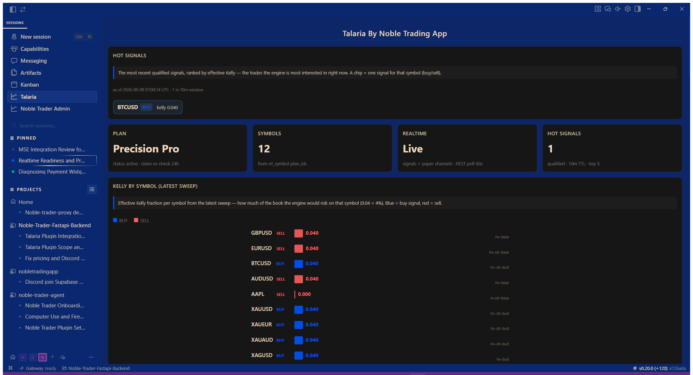
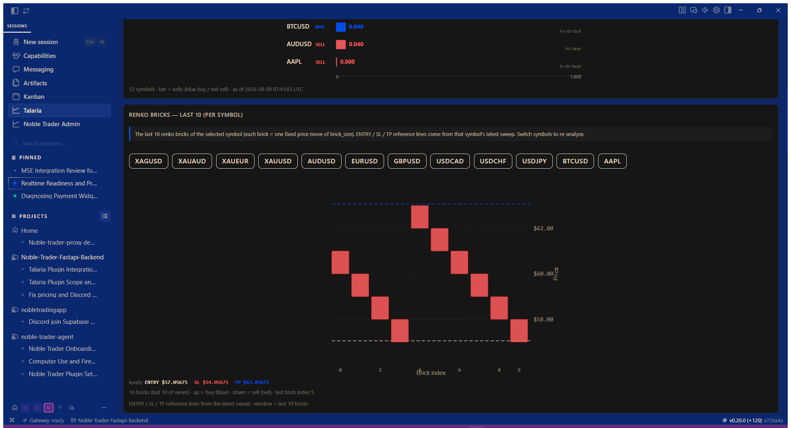

<p align="center">
  
  
  
</p>

# Talaria — Noble Trader signals, inside your Hermes

**Talaria** is the client-facing Hermes Desktop plugin for the **Noble Trader**
signal service. It brings live signals, renko charts, signal health, and paper
analytics straight into your Hermes agent — no backend, no local server, no
secrets on your machine. The plugin talks to Supabase directly with a public
(read-only) key, so **nothing sensitive ever touches your device**.

> 🔒 **Subscription required.** Talaria is a paid service. Choose your plan at
> **[nobletrading.app](https://nobletrading.app)** — your claim token unlocks
> the dashboard after checkout.

## Screenshots

Live signals, ranked by edge — with the renko brick chart showing the price
action behind each signal:

| Dashboard | Renko chart |
|---|---|
|  |  |

---

## What's in this release (v0.2.3)

**Plan-scoped realtime channels + channel rename.**

| Change | Detail |
|---|---|
| **Plan-scoped signal broadcasts** | Signals are now published per plan: `realtime:signals.signal_scout` (Scout's symbols) and `realtime:signals.precision_pro` (Pro's symbols). The backend routes each signal to the topic(s) matching the symbol's plan membership; the plugin joins only its own plan's topic (decided by the server-validated claim — never client-guessed). Pro subscribers receive Scout + Pro symbols; Scout subscribers receive only their 10. |
| **`realtime:paper` → `realtime:portfolio`** | The paper-validation channel was renamed. It carries the **simulated validation book** (positions the engine would have taken, realized PnL, equity ticks) — not a demo trading account. Topic is now `realtime:portfolio` (Precision Pro only). |
| **Fail-open routing** | If a symbol's plan membership can't be resolved, the signal is published to **both** plan topics so no subscriber misses it. Unknown plan claims also join both topics (same rule). |
| **Widget display order + dedup** | The signals pane now renders **most-recent-at-top** (newest first, always — even after a batch poll), the pinned card shows the actual newest signal instead of a stale persisted one, and a signal **never renders twice** (the card's signal is excluded from the list — fixes the duplicated-row look in the widget). Badge counts all live signals. |
| **Date/Time columns in user locale** | The Paper portfolio table's timestamp column is now **Date/Time** in your **local timezone** (e.g. `2026-08-10 13:25 PDT`) instead of a raw UTC `ts`. Same change in the admin plugin's Recent signals table. |
| **Supabase Realtime dashboard** | Nothing to configure there — broadcast channels are dynamic. No triggers, policies, or publications are needed for this broadcast-only setup. |

**Data flow:** Noble Trader's quant engine sweeps symbols every 5 minutes
(light) and weekly (heavy), and qualified signals are published to Supabase →
your Talaria dashboard renders them in real time.

---

## What's in this release (v0.2.2)

| Component | What it is |
|---|---|
| **Talaria desktop plugin** | Native Hermes Desktop page: live hot signals, renko brick charts (hover for prices), per-symbol signal health, paper book + portfolio analytics, 60s auto-refresh + realtime updates. **v0.2.2 widget:** live qualified-signal badge (pane shows `N live`, chip shows `Talaria · N`), ENTRY/SL/TP pricing on EVERY displayed signal, ENTRY price in toasts, 10-min TTL hot-signal count, plugin version shown in footers |
| **talaria-tools** | In-chat agent tools — `talaria_health`, `talaria_stats`, `talaria_calibration` — so your Hermes agent can answer "what does this signal mean?" |
| **talaria-client skill** | A skill your agent installs to explain signals, history, calibration, and paper-vs-equal-weight in plain language |
| **Signal notifier + daily digest** | Optional Hermes cron scripts that deliver new signals to whatever messaging you've connected |
| **Supabase migrations** | The read-only views/tables the plugin reads (anon RLS — subscribers can only SELECT) |

## Why Noble Trader

Talaria isn't a chart with arrows. Behind every signal is a pipeline built to
**produce fewer, higher-conviction calls**:

- **Renko bricks** — price action rebuilt as fixed-size bricks, so only real
  price moves count (no time-based noise)
- **HMM regime detection** — the engine knows whether it's in a trending or
  ranging, high- or low-volatility market before it says anything
- **TimesFM foundation-model forecasts** — a learned view of "what happens
  next", fed in as a confidence-gated input
- **EV Engine v5** — four probability sources (pattern, regime, Markov,
  TimesFM) blended into one expected-value score; nothing is trusted alone
- **7 quality gates + Kelly sizing** — most signals are rejected on purpose;
  the ones that publish carry an explicit edge estimate and a math-sized
  position
- **Weekly recalibration + nightly calibration-bias correction + paper-book
  validation** — the engine re-adapts to the market and is audited against
  realized outcomes

> Want the full technical tour? See [How Noble Trader works](docs/HOW_IT_WORKS.md).

## Install

Requirements: **Hermes Desktop** (Electron app), ~2 minutes.

**1. Install Hermes** — Talaria runs inside the Hermes Desktop app. Install
Hermes first (see [How to install Hermes](#how-to-install-hermes) below), then
launch it once so your home directory is created.

**2. Copy the plugin to your Hermes home** — the desktop app loads the plugin
from its `desktop-plugins` directory:

```bash
# Download talaria-plugin-v0.2.3.zip from the Releases tab, then:
unzip talaria-plugin-v0.2.3.zip
SRC=talaria-plugin/plugin.js
for d in \
  "$HOME/AppData/Local/hermes/desktop-plugins/talaria" \
  "$HOME/AppData/Local/hermes/profiles/<your-profile>/desktop-plugins/talaria"; do
  mkdir -p "$d" && cp "$SRC" "$d/plugin.js" && echo "OK $d"
done
```

> The exact path depends on your Hermes home and active profile. The desktop
> app loads plugins from `<hermes-home>/desktop-plugins/` (default home) or
> `<hermes-home>/profiles/<active-profile>/desktop-plugins/` (when a
> non-default profile is active). If the widget doesn't appear after restart,
> check which profile is active and copy to its `desktop-plugins` too.

**3. (Optional) Python chat tools** — copy `talaria-tools/` to
`<hermes-home>/profiles/<your-profile>/plugins/` and set
`TALARIA_SUPABASE_URL`, `TALARIA_SUPABASE_KEY` (the public anon key — same
values the plugin uses by default), `TALARIA_CLAIM_TOKEN` (from
nobletrading.app).

**4. (Optional) Agent skill** — copy the `talaria-client` skill so your
Hermes agent can answer signal questions:

```bash
cp -r skills/trading/talaria-client "$HOME/AppData/Local/hermes/profiles/<your-profile>/skills/trading/"
```

**5. Restart Hermes Desktop** (or ⌘K → *Reload desktop plugins*), enable
**Talaria** in Settings → Plugins, and open the **Talaria** tab.

**6. Connect** — paste your **claim token** (get it from
**[nobletrading.app](https://nobletrading.app)** after checkout). The service
connection is pre-configured — no URLs or keys to enter. The dashboard unlocks.

> Windows users: the paths above assume the default Hermes home. If your
> profile lives elsewhere, substitute `<your-profile>` and the profile's
> `desktop-plugins` path.

## Verify it works

1. Open the **Talaria** tab → Connect → paste your claim token → dashboard renders (signals, charts).
2. Try the chat: *"what does this signal mean?"* → your agent answers using
   `talaria-client`.
3. The dashboard refreshes every 60s and updates live via Supabase Realtime.

## How to install Hermes

Talaria is a plugin for **Hermes Desktop** — the native Electron app by
[Nous Research](https://hermes-agent.nousresearch.com). If you don't have it
yet:

**1. Install Hermes (Windows / macOS / Linux)**

```bash
# Official shell installer (sets up uv, Python, the venv, and the launcher)
curl -fsSL https://hermes-agent.nousresearch.com/install.sh | bash
```

**2. Launch the desktop app**

```bash
hermes desktop        # native Electron desktop app (alias: hermes gui)
```

On first launch, run the setup wizard to pick your model provider:

```bash
hermes setup          # model + provider + preferences
hermes model          # switch models any time
hermes doctor         # health check if something's off
```

**3. Where your Hermes home is**

- Default home: `~/.hermes/` (on Windows: `C:\Users\<you>\.hermes\`)
- Or `%LOCALAPPDATA%\hermes\` if you installed via the Windows desktop
  bundle — the app resolves `HERMES_HOME` from the registry first.
- With a non-default profile active: `~/.hermes/profiles/<profile>/` (or
  `%LOCALAPPDATA%\hermes\profiles\<profile>\`).

Talaria's plugin file goes in `<hermes-home>/desktop-plugins/talaria/plugin.js`
(or the active profile's `desktop-plugins/` — see [Install](#install)).

> **Windows note:** after installing, log out/in or open a fresh terminal so
> `hermes` is on your PATH. `hermes desktop` launches the app; the plugin
> shows up under Settings → Plugins → **Talaria** after a restart or
> ⌘K → *Reload desktop plugins*.

## Quick user guide — get the most out of Talaria

Talaria is more than a dashboard tab. Here's the 5-minute setup to make it
yours.

**1. Keep signals beside your chat (widget pane)**

After connecting, enable the **Talaria signals** pane (Settings → Plugins →
Talaria). A live widget docks to the right of your chat session showing the
latest signal with its ENTRY / SL / TP levels, a live qualified-signal count
(every row shows ENTRY / SL / TP), and a rolling list of recent signals
(last 60 minutes). Click a signal → full dashboard.
You can drag or resize the pane; it stays live while you work anywhere in
Hermes.

**2. Let your agent answer signal questions (skills + tools)**

Copy the `talaria-client` skill (see [Install](#install)) and enable the
**talaria-tools** plugin. Then in chat you can ask:

- *"What does this signal mean?"*
- *"How has XAUUSD been calibrated this week?"*
- *"What's our paper portfolio performance?"*
- *"Summarize today's signals."*

Your agent answers from live data — no manual lookups.

**3. Get notified without watching the screen**

Two optional cron jobs ship with Talaria (see `scripts/`):

- **Signal notifier** — every 5 min, prints *new* qualified signals to your
  connected chat (Discord/Telegram/desktop).
- **Daily digest** — one markdown summary per day at 15:00 of signals,
  health, and calibration.

Enable them in Hermes (cron UI or `hermes cron`) and connect a messaging
channel with `hermes setup` → *gateway* if you want them outside the desktop
app.

**4. Set up memory so Talaria "knows" you**

Hermes keeps persistent memory per profile. Tell it the facts that matter and
they stick across sessions:

- *"Remember: I trade gold and metals, primarily XAUUSD and XAGUSD."*
- *"Remember: I prefer signals with kelly ≥ 0.1."*
- *"Remember: summarize signals in my local timezone."*

The agent also saves lessons learned from your corrections, so it gets better
at answering Talaria questions over time.

**5. Understand what you're looking at**

- **Hot signals** — the most recent qualified signals, ranked by Kelly (the
  engine's conviction). Chips drop off after 10 minutes.
- **Renko chart + levels legend** — the price structure behind the signal;
  ENTRY / SL / TP shown in full below the chart.
- **Signal health / calibration** — per-symbol win rates and whether the
  engine is over- or under-confident.
- **Paper portfolio (Pro)** — simulated book the strategy is validated
  against; PnL is realized only on close, so open positions show `$0/—`.

**6. Keep it fresh**

The dashboard auto-refreshes every 60s and streams live when available. The
widget pane shows only the last 60 minutes of signals; the badge counts live
qualified signals and clears when the last signal ages out.

## Docs

- [talaria-client skill](skills/trading/talaria-client/SKILL.md) — what your agent can answer for you
- [OPERATIONS.md](docs/OPERATIONS.md) — operator/deploy notes
- [DEVELOPMENT.md](docs/DEVELOPMENT.md) — repo structure, install details, release checklist

## Subscribe

Talaria plans (Signal Scout / Precision Pro) are managed at
**[nobletrading.app](https://nobletrading.app)** — checkout, claim tokens,
and account management live there. The plugin is the client; the portal is
where your subscription is handled.

---

Copyright © Lexington Tech LLC
